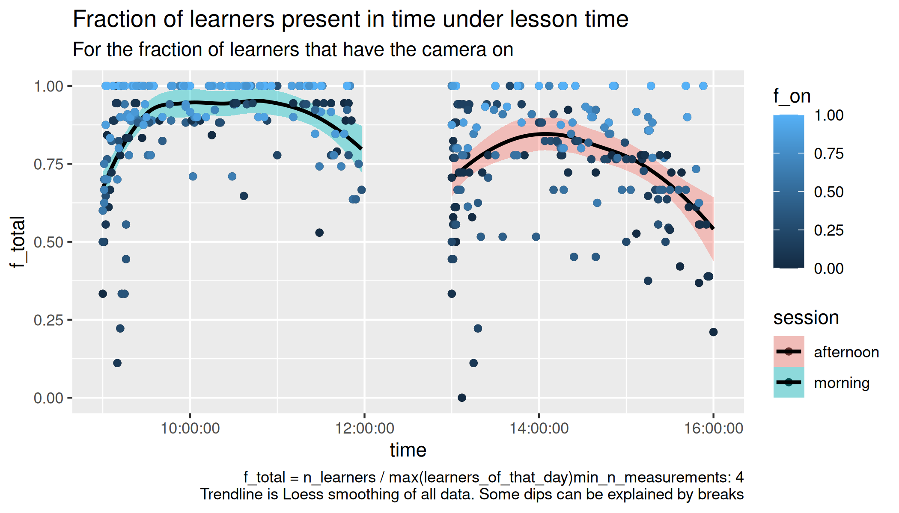
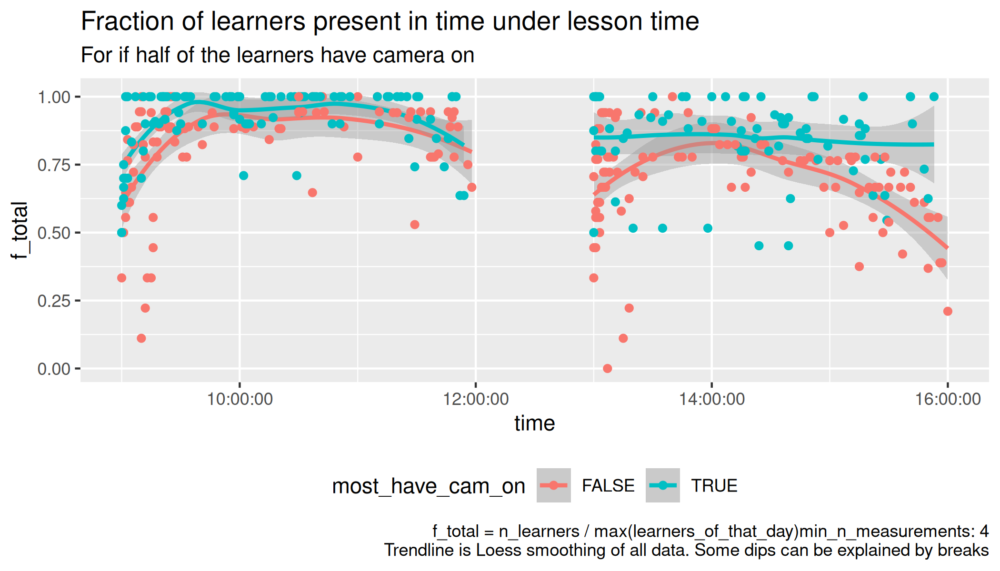

# Counts

Goal of this experiment is to see how important camera usage is for
keeping learners in an online course.

## Data description

The data consists out of the files

Filename           |Description
-------------------|-------------------------
`description.csv`  |The course descriptions
`[date]_counts.csv`|Date the data was collected, where `[date]` is in `YYYYMMDD` format

`description.csv` field|Description
-----------------------|-------------------------------------------
`date`                 |Date of the the course in `YYYYMMDD` format
`description`          |Course description
`t_start`              |Starting time
`t_end`                |Ending time

`[date]_counts.csv` field|Description
-------------------------|-------------------------------------
`time`                   |Time
`n_cam_on`               |Number of learners with the camera on. This excludes teacher(s) and assistants
`n_cam_off`              |Number of learners with the camera on. This excludes teacher(s) and assistants

## Preliminary conclusions

- At 10:00 and 14:00 the amount of learners peaks
- When most learners have had their camera on before lunch,
  more return after lunch

## Do trendline per day

## Do trendline per session

