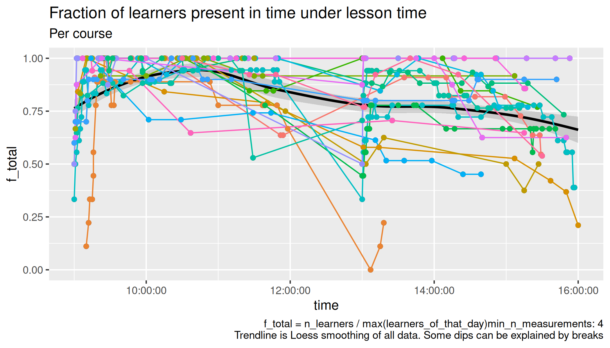
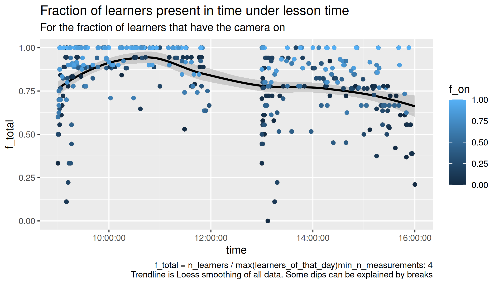
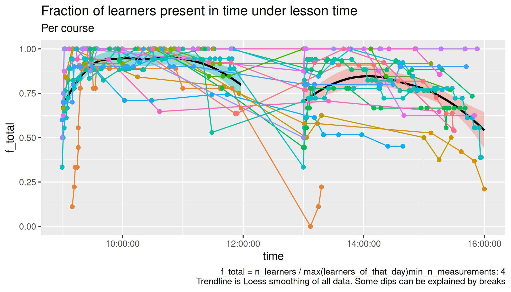

# Counts

Goal of this experiment is to see how important camera usage is for
keeping learners in an online course.

## Introduction

At both NBIS and NAISS we report the number of learners in our courses.
The number that is used for reporting is typically the amount
of learners at the start of a course.

However, during the day, learners can arrive late and/or leave early.
Especially for online courses it is easy to leave early.

The amount of learners leaving early may be caused by many factors.
One such factor is the amount of interactivity of a course.
One could argue that an interactive course is likelier
to have learners turn on their cameras,
as learners need/want to communicate face-to-face with
their peers and teacher.

An easily observable feature of a course is the amount of
cameras that learners have on.
Measuring only this will not prove a course being interactive or not.
Without making any claim of showing a mechanism, this empirical
study shows the progression of the amount of learners throughout
the day for online courses and the effect of (the majority)
the learners having their cameras on or off.

## Hypothesis

- H1: What is the progression of the number of learners over a day
  during a day-long online course?

- H2: What is the effect of having cameras on/off on learners being present
  over a day during a day-long online course?

## First conclusions

The progression of the number of learners over a day is as follows:
Around 80% of all learners are present at course start,
after which the amount increases.
At 10:30, the heighest amount of learners during the day are present,
after which this number decreases.
See figure 2 for the exact numbers.

The effect of having cameras on/off on learners being present is as follows:
there are consistently more learners remaining during the day when
cameras are on.
See figure 3 for the exact numbers.

This difference increases during the day.
<!-- plot difference -->

There is already an effect of learners showing up on time
when a course is announced to require cameras,
as can be shown for the 9:00-9:30 data points in figure 3.

## Discussion

There is no investigation of the mechanism that causes learners to leave
a course earlier.

An unexpected finding is that more learners show up on time
when a course is announced to require cameras.
This could encourage both course leaders and teachers
to **announce the use of cameras in course announcements**.

The study design can definitely be improved.
In the acquired dataset,
each course iteration is sometimes given by one
teacher, where sometimes there are as much as four teachers
during a day.
**In an ideal study design, a course is given by one teacher twice**:
once with cameras encouraged to be on, and once with
cameras off. This study chose to obtain data as unobtrusively as possible,
with the hope of sketching a baseline expectation for further research.

Additionally, there may be possible correlation between
teachers that encourage learners to turn on their cameras
and the courses they pick to teach.
**In an ideal study design, a course is given by multiple teachers twice**.
Again, the aim of this study was to sketch a baseline expectation
for further research.

Given the big amount of learners lost during a day,
with already 25% of all learners having left at lunch,
course coordinators could consider
to ask teachers to **report the number of learners after lunch** too.
Although this research makes no claim about any mechanism for learners
leaving early, reporting this number will make teachers aware of
a low or high dropout rate during their teaching.
Having a low dropout rate should not be use as a perverse
incentive (i.e. there should be no effects on career),
but may inspire a teacher to (re)think his/her practice.

Given the big difference in learners remaining in the course,
for having a camera on or off,
teachers may feel more
**encouraged to ask their learners to turn on their cameras**.

## File overview

- [analyse.R](analyse.R): the analysis
- [description.csv](description.csv): description of the `counts` files
- [20240419_counts.csv](20240419_counts.csv)
- [20240422_counts.csv](20240422_counts.csv)
- [20240423_counts.csv](20240423_counts.csv)
- [20240424_counts.csv](20240424_counts.csv)
- [20240425_counts.csv](20240425_counts.csv)
- [20240426_counts.csv](20240426_counts.csv)
- [20240515_counts.csv](20240515_counts.csv)
- [20240524_counts.csv](20240524_counts.csv)
- [20240822_counts.csv](20240822_counts.csv)
- [20240823_counts.csv](20240823_counts.csv)
- [20240827_counts.csv](20240827_counts.csv)
- [20240828_counts.csv](20240828_counts.csv)
- [20240829_counts.csv](20240829_counts.csv)
- [20240830_counts.csv](20240830_counts.csv)
- [20240925_counts.csv](20240925_counts.csv)
- [20241022_counts.csv](20241022_counts.csv)
- [20241024_counts.csv](20241024_counts.csv)
- [20241111_counts.csv](20241111_counts.csv)
- [20241118_counts.csv](20241118_counts.csv)
- [20241119_counts.csv](20241119_counts.csv)
- [20241120_counts.csv](20241120_counts.csv)
- [20241121_counts.csv](20241121_counts.csv)
- [20241122_counts.csv](20241122_counts.csv)
- [20250210_counts.csv](20250210_counts.csv)
- [20250304_counts.csv](20250304_counts.csv)
- [20250307_counts.csv](20250307_counts.csv)
- [20250319_counts.csv](20250319_counts.csv)
- [20250324_counts.csv](20250324_counts.csv)

## Data description

The data consists out of the files

| Filename            | Description                                                         |
| ------------------- | ------------------------------------------------------------------- |
| `description.csv`   | The course descriptions                                             |
| `[date]_counts.csv` | Date the data was collected, where `[date]` is in `YYYYMMDD` format |

| `description.csv` field | Description                                 |
| ----------------------- | ------------------------------------------- |
| `date`                  | Date of the the course in `YYYYMMDD` format |
| `description`           | Course description                          |
| `t_start`               | Starting time                               |
| `t_end`                 | Ending time                                 |

| `[date]_counts.csv` field | Description                                                                    |
| ------------------------- | ------------------------------------------------------------------------------ |
| `time`                    | Time                                                                           |
| `n_cam_on`                | Number of learners with the camera on. This excludes teacher(s) and assistants |
| `n_cam_off`               | Number of learners with the camera on. This excludes teacher(s) and assistants |

## Do trendline per day

> Figure 1:
> Number of learners during the day per course.
> One trendline per day

> Figure 2: Number of learners during the day,
> showing the factions of learners that have a camera on.
> One trendline per day

> Figure 3:
> Number of learners during the day
> separating by the majority having camera on/off.
> One trendline per day

## Do trendline per session

> Figure 4:
> Number of learners during the day per course.
> One trendline per half-day

> Figure 5: Number of learners during the day,
> showing the factions of learners that have a camera on.
> One trendline per half-day

> Figure 6:
> Number of learners during the day
> separating by the majority having camera on/off.
> One trendline per half-day
