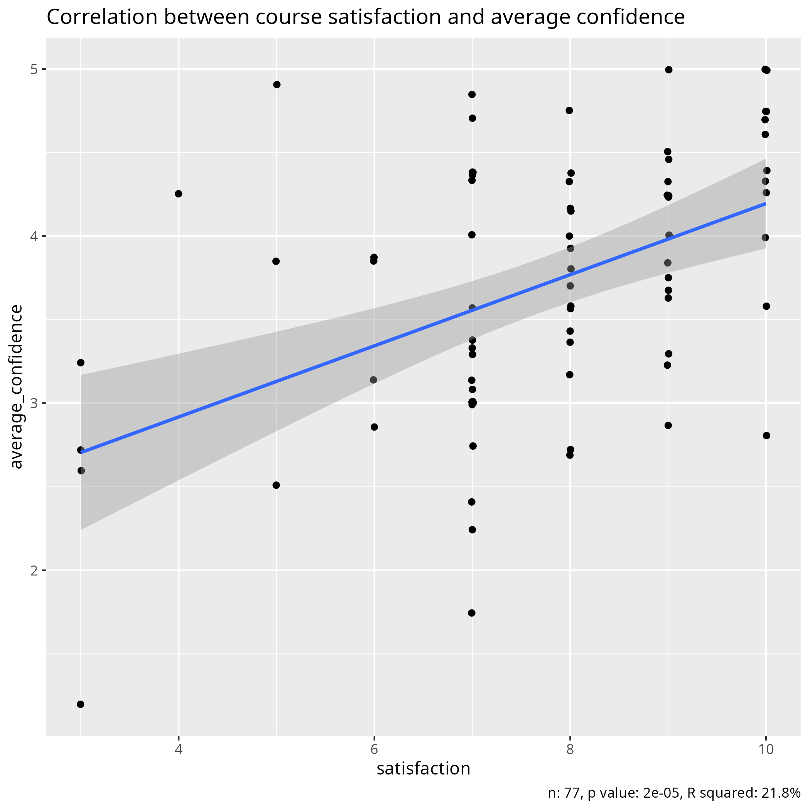

# Confidence and satisfaction

## Introduction

Teachers ask their learners for feedback with the goal of improving
their teaching. One question that appears commonly in such anonymous
feedback form is to let the learner rate the course and/or give his/her
satisfaction of the course. There are plenty of small studies that
find a relation between these scores and course quality indicator.
However, meta analyses `[Clayson, 2009][Uttl et al., 2017]`
reveal that this relation is most likely to be
found in (1) small studies, (2) studies in the field of
pedagogy, (3) low methodological rigor. Or in other words: this
relation vanishes when the studies get bigger and have stronger defined
metrics.
One of these two meta analyses (`[Clayson, 2009]`)
helps understand why we may have the misconception that there is a relation
between course satisfaction and course quality:
humans are quite capable to always 'explain' a low or high course satisfaction
in hindsight.

Even though asking learners to rate a course is useless, managers and/or
funders insist on asking so anyways. One reason to do so, is
to continue a timeline of data collection,
such as is done by the Europe-wide
bioinformatics training organisation ELIXIR, reporting
course quality indicators in their
[Training Metrics Database](https://tmd.elixir-europe.org/report/set/quality)
since 2009.
Another example is the National Academic Infrastructure for Super­computing
in Sweden ('NAISS'), which insists on asking learners to grade a course
after having attended one.

Both centers, however, help alleviate the problem by letting teachers
add their own course evaluation questions.

One addition to these question can be to let learners rate their
confidence in each of the objectives.

Students that report their progress to be good do have higher
grades `[Benton et al., 2013]`.

???- question "Numbers in that study?"

    Numbers from `[Benton et al., 2013]`:

    - 188 learners
    - 5 different exams
    - 4 out of 5 exams show a significant correlation
    - Pearson correlation coefficient: around 0.5.
    - Slope is around 0.4 grade (scale 0 to 5)
      increase per level of confidence (scale 1 to 5).

Also `[Sundström, 2011]` concludes that self-reported skills
have a correlation with actual skills.

???- question "Numbers in that study?"

    Numbers from `[Sundström, 2011]`:

    - 136 learners
    - Two self-assessment measures
    - Pearson correlation coefficient for Perceived Practical Driver Competence
      (PPDC): around 0.7.
    - Pearson correlation coefficient for Self-Assessment of Driving Skills
      (SADS): around 0.7.
    - Slope is unreported

A big meta-analysis `[Sitzmann et al., 2010]`, however, finds
that there is no correlation between self-reported increases in knowledge
and knowledge gains.

???- question "Numbers in that study?"

    Numbers from `[Sitzmann et al., 2010]`

    - 166 studies
    - 41,237 learners

An open question is if asking learners to report their progress
may be a useful mean to assess course quality.
So far, there has been one small study (i.e. 31 learners) done on this,
`[Liaw et al., 2012]`,
which concludes that self-confidence on learning outcomes
cannot predict performance.

Assuming that both course ratings and self-assessed confidence have
no relation to course quality, are they themselves correlated?

Hypothesis:

- Course ratings and self-assessed confidence are uncorrelated

Methods

- They are correlated
- 21.4% of the variance is explained by the correlation

- `[Clayson, 2009]` Clayson, Dennis E. "Student evaluations of teaching:
  Are they related to what students learn?
  A meta-analysis and review of the literature."
  Journal of marketing education 31.1 (2009): 16-30.

- `[Uttl et al., 2017]`
  Uttl, Bob, Carmela A. White, and Daniela Wong Gonzalez.
  "Meta-analysis of faculty's teaching effectiveness:
  Student evaluation of teaching ratings and student learning are not related."
  Studies in Educational Evaluation 54 (2017): 22-42.

- `[Liaw et al., 2012]` Liaw, Sok Ying, et al. "Assessment for simulation learning outcomes: a comparison of knowledge and self-reported confidence with observed clinical performance." Nurse education today 32.6 (2012): e35-e39.

- `[Benton et al., 2013]` Benton, Stephen L., Dennis Duchon, and William H. Pallett. "Validity of student self-reported ratings of learning." Assessment & Evaluation in Higher Education 38.4 (2013): 377-388.

- `[Sundström, 2011]` Sundström, Anna. "The validity of self-reported driver competence: Relations between measures of perceived driver competence and actual driving skill." Transportation research part F: traffic psychology and behaviour 14.2 (2011): 155-163.

- `[Copur-Gencturk et al., 2021]` Copur-Gencturk, Yasemin, and Ian Thacker. "A comparison of perceived and observed learning from professional development: Relationships among self-reports, direct assessments, and teacher characteristics." Journal of teacher education 72.2 (2021): 138-151.

- `[Sitzmann et al., 2010]` Sitzmann, Traci, et al. "Self-assessment of knowledge: A cognitive learning or affective measure?." Academy of Management Learning & Education 9.2 (2010): 169-191.
