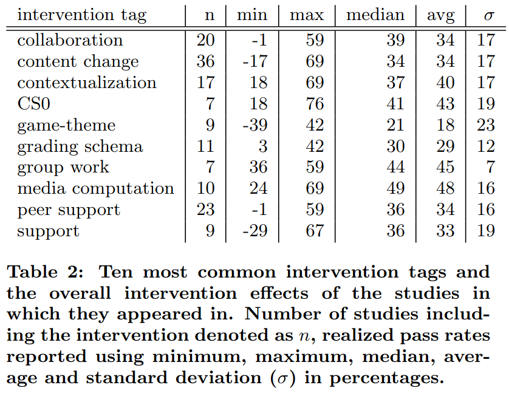

# Teaching online

Media computation, group work and CS0 have the highest average pass rate:

> Table 2 from `[Vihavainen et al., 2014]`:
> 'Ten most common intervention tags and
> the overall intervention effects of the studies in
> which they appeared in.
> Number of studies including the intervention denoted as n,
> realized pass rates reported using minimum, maximum, median,
> average and standard deviation (σ) in percentages'.

Here are the definitions given in that paper:

- 'CS0 : the creation of a preliminary course that was to
  be taken before the introductory programming course;
  could be organized only for e.g. at-risk students
- 'group work : activities with increased group work
  commitment such as team-based learning and cooperative
  learning'
- 'media computation: activities explicitly declaring the
  use of media computation (e.g. the book)'. The paper elaborates with:
  'each article that was coded with the tag media computation, tags content:
  media, contextualization, context: media, were added to de-
  scribe that the content (material) of the course was updated
  to contain media-type content, the course was contextual-
  ized so that the content had more meaning to the students
  that participated in the course, and finally, that the context
  revolved around media'

The study `[Medeiros et al., 2018]` tries to do a review on teaching
programming, with a big heterogeneity in how experiments are performed.
A main finding is:

> The most frequently cited skills necessary for
> learning programming were related to problem solving and mathematical ability.
> Problem solving was also cited as a learning
> challenge, followed by motivation and engagement,
> and difficulties in learning the syntax of programming languages

Note the motivation and -especially- engagement:
this will be lacking in a monologue.

There is no evidence that live coding is effective for learning,
although it has been recommended by other literature,
as those papers mostly judged live coding from the learners'
perspective, instead of actual learning effectiveness `[Selvaraj et al., 2021]`.

## Quickscans

`[NSQ 2025]` has these national standards for quality online teaching:

- STANDARD A: PROFESSIONAL RESPONSIBILITIES: The online teacher demonstrates professional competence by adhering to professional responsibilities.
  - A1 The online teacher meets or is working towards local and/or state/national requirements for eligibility to teach.
  - A2 The online teacher demonstrates technological proficiency.
  - A3 The online teacher adheres to local or national laws or mandates related to the safety and success of all students.
  - A4 The online teacher is a reflective practitioner.
  - A5 The online teacher regularly participates in professional learning related to online learning and pedagogy.
  - A6 The online teacher effectively manages their roles and responsibilities.
  - A7 The online teacher models digital citizenship including the responsible use of emerging technologies.
  - A8 The online teacher advocates for quality online learning with stakeholders.
- STANDARD B: DIGITAL CITIZENSHIP: The online teacher facilitates learning experiences that model and promote digital citizenship while ensuring fair access and participation for all learners.
  - B1 The online teacher facilitates learning experiences that promote responsible digital citizenship for all learners.
  - B2 The online teacher establishes expectations for learner behavior that encourage academic integrity and appropriate use of digital tools in adherence to local policies.
  - B3 The online teacher models compliance with intellectual property policies and fair-use standards while fostering learner understanding and responsible application of these concepts.
  - B4 The online teacher implements national and local policies designed to safeguard all learners in digital learning environments.
- STANDARD C: ENGAGEMENT AND BELONGING: The online course incorporates instructional materials, activities, resources, and assessments that align with standards, engage all learners, and support the achievement of academic goals.
  - C1 The online teacher provides and/or directs learners to technical support in a prompt manner.
  - C2 The online teacher identifies patterns in learner engagement.
  - C3 The online teacher nurtures individual learner agency.
  - C4 The online teacher communicates in a timely and supportive manner.
  - C5 The online teacher provides actionable, specific, and timely feedback.
  - C6 The online teacher provides and/or facilitates the development of community engagement expectations.
  - C7 The online teacher facilitates collaboration among learners.
  - C8 The online teacher responds quickly to violations of the community engagement expectations.
  - C9 The online teacher leverages partnerships with stakeholders within the student’s local learning community.
- STANDARD D: LEARNER-CENTERED INSTRUCTION: The online teacher personalizes instruction based on the learner’s academic, social, and emotional needs.
  - D1 The online teacher collaborates with stakeholders.
  - D2 The online teacher builds an understanding of the learner’s needs and preferences.
  - D3 The online teacher supports the learner’s use of assistive technologies.
  - D4 The online teacher continuously monitors learner progress.
  - D5 The online teacher analyzes a variety of data sources.
  - D6 The online teacher creates or adapts curricular materials in response to the learner’s needs.
  - D7 The online teacher modifies instructional strategies in response to the learner’s needs.
- STANDARD E: INSTRUCTIONAL DESIGN: The online teacher curates and creates instructional materials, tools, strategies, and resources to engage all learners and ensure the achievement of academic goals. This standard and indicators are considered optional, as instructional design does not always fall under online teaching responsibilities. For full online course design standards, see the National Standards for Quality Online Courses. The following section outlines standards for instructional design skills for the online teacher of record, where applicable.
  - E1 The online teacher aligns course content with associated learning goals.
  - E2 The online teacher incorporates subject-specific resources.
  - E3 The online teacher incorporates developmentally appropriate resources.
  - E4 The online teacher incorporates resources that are representative of the learners.
  - E5 The online teacher designs courses with continuous assessment opportunities.
  - E6 The online teacher designs curricular materials that incorporate constructive feedback.
  - E7 The online teacher develops a range of assessments.
  - E8 The online teacher designs learning experiences that efficiently use technology.
  - E9 The online teacher continuously reviews and updates course content.

## References

- `[Medeiros et al., 2018]` Medeiros, Rodrigo Pessoa, Geber Lisboa Ramalho, and Taciana Pontual Falcão. "A systematic literature review on teaching and learning introductory programming in higher education." IEEE Transactions on Education 62.2 (2018): 77-90.
- `[Selvaraj et al., 2021]` Selvaraj, Ana, et al. "Live coding: A review of the literature." Proceedings of the 26th ACM Conference on Innovation and Technology in Computer Science Education V. 1. 2021.
- `[Vihavainen et al., 2014]` Vihavainen, Arto, Jonne Airaksinen, and Christopher Watson. "A systematic review of approaches for teaching introductory programming and their influence on success." Proceedings of the tenth annual conference on International computing education research. 2014.
- `[NSQ 2025]` [NSQ National standards for quality online teaching](National-Standards-for-Quality-Online-Teaching-2025-Accessible.pdf)
