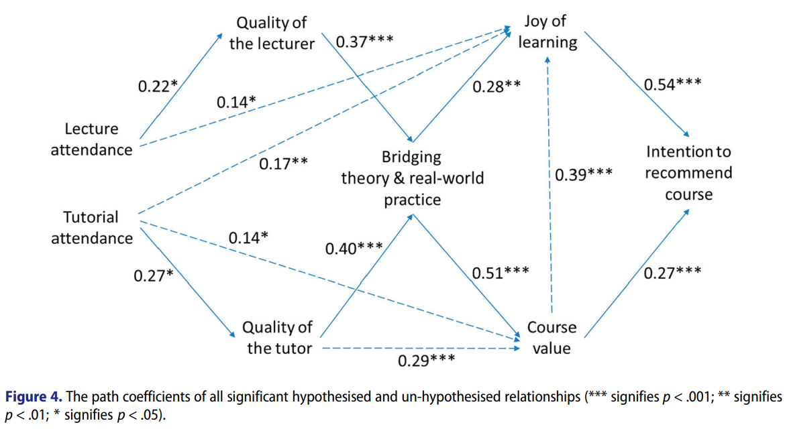

---
tags:
  - paper
---

# No need to bother students to fill in course evaluations

For decades, universities have been asking their students about their
experiences with their courses, with the goal of improving the quality
of the courses. However, it is mostly misconceptions instead of real
successes.

## Survey questions

### Survey question: What is your overall rating for the course?

A critical meta-analyses concluded that there is no relationship
between the students' responses and any metric related to course
quality, as it is mostly small studies in pedagogy with low rigor
that happen to find a relation [Clayson, 2009].

This question is used in many course evaluations, such as the European
bioinformatics training center called ELIXIR [Gurwitz et al., 2020].

### Survey question: How satisfied are you with the course?

A critical meta-analyses concluded that there is no relationship
between the students' responses and any metric related to course
quality, as it is mostly small studies in pedagogy with low rigor
that happen to find a relation [Uttl et al., 2017].

### Survey question: How confident are you in the learning outcomes?

Even student self-assessment in achieving the courses' learning
outcomes have no relation with actual test performance [Liaw et al., 2012].
This is a study on 33 learners.

### Survey question: Would you recommend this course?

`[Ang et al., 2018]` did a study, on 113 learners,
that concluded that having a positive response
to this question is mostly determined by the joy of learning
in the course. This joy of learning is most strongly determined
by tutors, **not** by the teacher.

The remaining determinant for a positive response
is the perceived value of the course,
which itself is mostly determined by the course bridging
theory and real-world practice.

This survey question hence mostly
measures the quality of the tutor(s) and to a lesser extent
the estimated benefit a course provides to the learner.
The study found that measuring its 7 determinants
predicts the answer to this survey question in around half of all cases.

???- question "Which relations did they find?"

    

    `[Ang et al., 2018]`, figure 4

This question is used in many course evaluations, such as the European
bioinformatics training center called ELIXIR [Gurwitz et al., 2020].

### Survey question: Say something positive, say something that can be improved

### Survey question: Any feedback?

###

`[Fernandez and Mateo, 1992]` checked many survey questions
and how these questions correlated to two dimensions
of teaching (teaching competence demonstrated and motivational skills).
The value is the rightmost value in table 2a, which is for university
level schooling

F1   |Description
-----|-------------------------------------------------------------------------
0.906|Explains the content of each subject coherently
0.902|Explains clearly
0.892|Comparative mark for the teacher as against others (same year)
0.892|His/her explanations held my attention in class
0.881|His/her way of teaching helps in the understanding of the subject matter
0.831|Shows him/herself competent in the content of the course given.
0.856|Reflects the usefulness of the class content explained.
0.795|Shows adequate previous preparation for the class.
0.846|Thanks to what I have learned I feel a greater interest for this area.
0.826|Establishes an adequate interrelation between the different subjects.
0.864|Arouses students' interest in the subject.
0.804|I would like to follow another course again with this teacher.
0.852|Answers questions accurately`
0.848|Secures students' attention for the subject matter explained
0.781|Shows enthusiasm for the class content explained.
0.736|Alludes to the implications of different viewpoints.

- `F1` = teaching skill demonstrated

F2   |Description
-----|---------------------------------------------------------------------
0.903|Encourages the expression of the students' own ideas.
0.888|Shows him/herself accessible in his/her relationship with students
0.872|Motivates students to ask about any doubts.
0.835|Stimulates student participation in class.
0.854|Shows interest in the concerns of each student.
0.807|Takes students' valuable ideas into consideration.

- `F2` = motivational skill demonstrated

See `[Marsh, 1984]` for a paper where 9 dimensions of teacher quality
are used.

### Questionnaires have no effect

- `[Spooren et al., 2013]`

### Ways to improve questionnaires

See `[Martínez-Gómez, 2011]`.

## Alternatives: use an observation and evaluation tool

E.g. the POET-O observation and evaluation tool `[Jia et al., 2025]`:

<!-- markdownlint-disable MD013 --><!-- Tables cannot be split up over lines, hence will break 80 characters per line -->

No.|Theme                       |Facet
---|----------------------------|-----------------------------------|
1  |Presentation and Activities |The lesson and learning activities are well organized
2  |.                           |Planned student activities reflect appropriate lesson objectives
3  |.                           |Depth and breadth of material presented appears appropriate to type of course, student level, and time dedicated to the topic
4  |.                           |Learning activities provide opportunities for interaction that support active learning
5  |.                           |Appropriate amount of content and course requirements are delivered
6  |.                           |Discussion forum is interactive
7  |.                           |Discussion forum and other learning tools promote critical thinking
8  |Use of Technology           |The instructor effectively uses audio/visual learning tools and technologies to support the learning objectives or competencies
9  |.                           |Learning tools and technologies used promote learner engagement and active learning
10 |.                           |Learning tools and technologies required in the module/unit are provided and/or readily obtainable
11 |.                           |Access to links and external resources provided are functional
12 |.                           |Learning tools and technologies used are current
13 |ADA Compliance/Accessibility|Presentation and organization of materials facilitate ease of use
14 |.                           |Information is provided regarding accessibility of all learning tools and technologies required in the lesson
15 |.                           |Alternative means of access to lesson materials in formats that meet the needs of diverse learners are provided
16 |.                           |All materials are designed to facilitate readability
17 |Assessment                  |Planned assessment strategies measure the stated learning objectives or competencies
18 |.                           |Specific and descriptive criteria are provided for the evaluation of learners’ work, i.e. rubrics etc
19 |.                           |Students are given ample time to complete the assignments and assessments for this lesson
20 |Instructor                  |Instructor provides an overview of what is planned for the lesson
21 |.                           |Instructor appears well prepared for lesson
22 |.                           |Instructor establishes the relevance of information
23 |.                           |Lesson content is up to date and there is evidence that instructor is knowledgeable about topics presented
24 |.                           |Content is explained clearly, providing examples when appropriate
25 |.                           |Instructor makes connections with prior learning (from previous lessons and courses) when applicable
26 |.                           |Instructor facilitates productive discussions related to content
27 |.                           |Instructor encourages critical thinking and expression of divergent opinions or conflicting views when appropriate
28 |.                           |Instructor contributes to discussion, providing encouragement, reflection, and corrective feedback
29 |.                           |Instructor provides periodic summaries of the most important ideas and ties things together at the end of the lesson
30 |.                           |Instructor uses active learning techniques
31 |.                           |Instructor treats students respectfully, offering encouragement in public ways and does not criticize student publicly
32 |.                           |Instructor utilizes diverse methods of instruction to accommodate all learners
32 |.                           |Instructor utilizes diverse methods of instruction to accommodate all learners

<!-- markdownlint-enable MD013 -->

Or, from `[Lee et al., 2020]`:

<!-- markdownlint-disable MD013 --><!-- Tables cannot be split up over lines, hence will break 80 characters per line -->

No.|Theme                                     |Facet
---|------------------------------------------|-----------------------------------
19 |Factor 1: Learning Activities & Materials |Assessments and activities are consistent with the course objectives and resources.
22 |.                                         |Activities provide students with opportunities to receive feedback early and frequently, specifically in preparation for high stakes assessments.
23 |.                                         |Course includes assessments and activities that are problem-centered or application-oriented in nature.
24 |.                                         |Students are encouraged to integrate new concepts into regular practice and understanding through demonstration, reflection, creation, or similar activities.
25 |.                                         |Resources & materials support learning objectives.
26 |.                                         |Resources & materials are sufficient for students to learn the subject.
27 |.                                         |Resources, materials, and instructor interactions activate students’ prior learning and experiences while introducing new concepts.
43 |.                                         |Tools and media support the learning objectives.
44 |.                                         |Tools and media are appropriately chosen and appropriately varied to enhance student interactivity with course content.
48 |.                                         |Course provides additional tutorials/resources as needed to accomplish objectives.
1  |Factor 2:Course Introduction & Design     |Upon first entering the course, students can easily find the course syllabus and introductory materials.
2  |.                                         |The progression of course content and activities is easy to find, clearly outlined, and appropriately segmented into units or modules.
3  |.                                         |Course appears visually clean, consistent, and appealing on the home page and throughout.
4  |.                                         |A course introduction orients student to the course environment and suggests the relevance of course materials and activities to students and/or program goals.
49 |Factor 3: Learner Support                 |Course provides technical support services link/description.
50 |.                                         |Course provides academic support services link/description.
51 |.                                         |Course provides student support link/description.
13 |Factor 4: Learner Engagement & Interaction|Provides clear expectations for student response, engagement, and participation.
14 |.                                         |Provides clear expectations for student etiquette in participation.
34 |.                                         |A means for making course announcements is clearly available and used regularly to encourage student completion and participation and to connect course content with current events and research.
35 |.                                         |Course design fosters interaction with other students.
36 |.                                         |Course design fosters interaction with content.
37 |.                                         |Appropriate synchronous or asynchronous means are provided for students to ask questions and receive answers from the instructor and/or students.
16 |Factor 5: Learning Objectives             |Objectives are clearly stated.
17 |.                                         |Objectives are measurable.
18 |.                                         |Objectives are consistent with the course material/assessments/assignments.
5  |Factor 6: Course Facilitation             |Course has an instructor introduction
6  |.                                         |Students have an opportunity to introduce themselves.
12 |.                                         |Course fees, if any, are explained.
33 |.                                         |Course design fosters interaction with instructors.
7  |Factor 7: Course Information              |The course grading policy is clearly stated.
9  |.                                         |Course technology requirements are addressed up front, if applicable.
10 |.                                         |Textbook information and other materials requirements are provided.
38 |Factor 8: Course Technology               |Course has a statement directing students with ADA-documented disability to the DRC for reasonable accommodations as needed.
45 |.                                         |Tools and media are as easy to use as is reasonably possible.
46 |.                                         |Tools and media are sufficiently compatible with web and other applicable standards.
15 |Factor 9: Course Management               |Syllabus addresses course-appropriate policies, including academic honesty, harassment, withdrawal and I-grades, and the student grievance process.
20 |.                                         |Appropriate pacing mechanisms (due dates, reminders, follow-ups) are used to ensure timely student completion and regular engagement.
21 |.                                         |Specific descriptive criteria are provided for the evaluation of student’s work and participation, ideally in the form of a rubric.

<!-- markdownlint-enable MD013 -->

## References

- `[Ang et al., 2018]` Ang, Lawrence, Yvonne Alexandra Breyer, and Joseph Pitt.
  "Course recommendation as a construct in student evaluations:
  will students recommend your course?." Studies in Higher Education 43.6
  (2018): 944-959.
- `[Clayson, 2009]` Clayson, Dennis E.
  "Student evaluations of teaching: Are they related to what students learn?
  A meta-analysis and review of the literature."
  Journal of marketing education 31.1 (2009): 16-30.
- `[Fernandez and Mateo, 1992]` Fernandez, Juan, and Miguel A. Mateo.
  "Student evaluation of university teaching quality: Analysis of a
  questionnaire for a sample of university students in Spain."
  Educational and Psychological Measurement 52.3 (1992): 675-686.
- `[Gurwitz et al., 2020]` Gurwitz, Kim T., et al.
  "A framework to assess the quality and impact of bioinformatics training
  across ELIXIR." PLoS computational biology 16.7 (2020): e1007976. website
- `[Jia et al., 2025]` Jia, Yuane, et al.
  "Validation of a peer observation and evaluation tool for online teaching
  in the US: Y. Jia et al."
  Educational technology research and development 73.1 (2025): 615-639.
- `[Lee et al., 2020]` Lee, Ji Eun, Mimi Recker, and Min Yuan.
  "The validity and instructional value of a rubric for evaluating
  online course quality: An empirical study." Online Learning 24.1 (2020): 245.
- `[Liaw et al., 2012]` Liaw, Sok Ying, et al.
  "Assessment for simulation learning outcomes: a comparison of knowledge and
  self-reported confidence with observed clinical performance."
  Nurse education today 32.6 (2012): e35-e39.
- `[Uttl et al., 2017]` Uttl, Bob, Carmela A. White, and Daniela Wong Gonzalez.
  "Meta-analysis of faculty's teaching effectiveness: Student evaluation of
  teaching ratings and student learning are not related."
  Studies in Educational Evaluation 54 (2017): 22-42.
- `[Marsh, 1984]` Marsh, Herbert W.
  "Students' evaluations of university teaching: Dimensionality, reliability,
  validity, potential biases, and utility." Journal of educational psychology 76.5 (1984): 707.
- `[Martínez-Gómez, 2011]` Martínez-Gómez, Mónica, et al.
  "A multivariate method for analyzing and improving the use of student
  evaluation of teaching questionnaires: A case study." Quality & Quantity 45.6 (2011): 1415-1427.
- `[Spooren et al., 2013]` Spooren, Pieter, Bert Brockx, and Dimitri Mortelmans.
  "On the validity of student evaluation of teaching: The state of the art."
  Review of Educational Research 83.4 (2013): 598-642.
