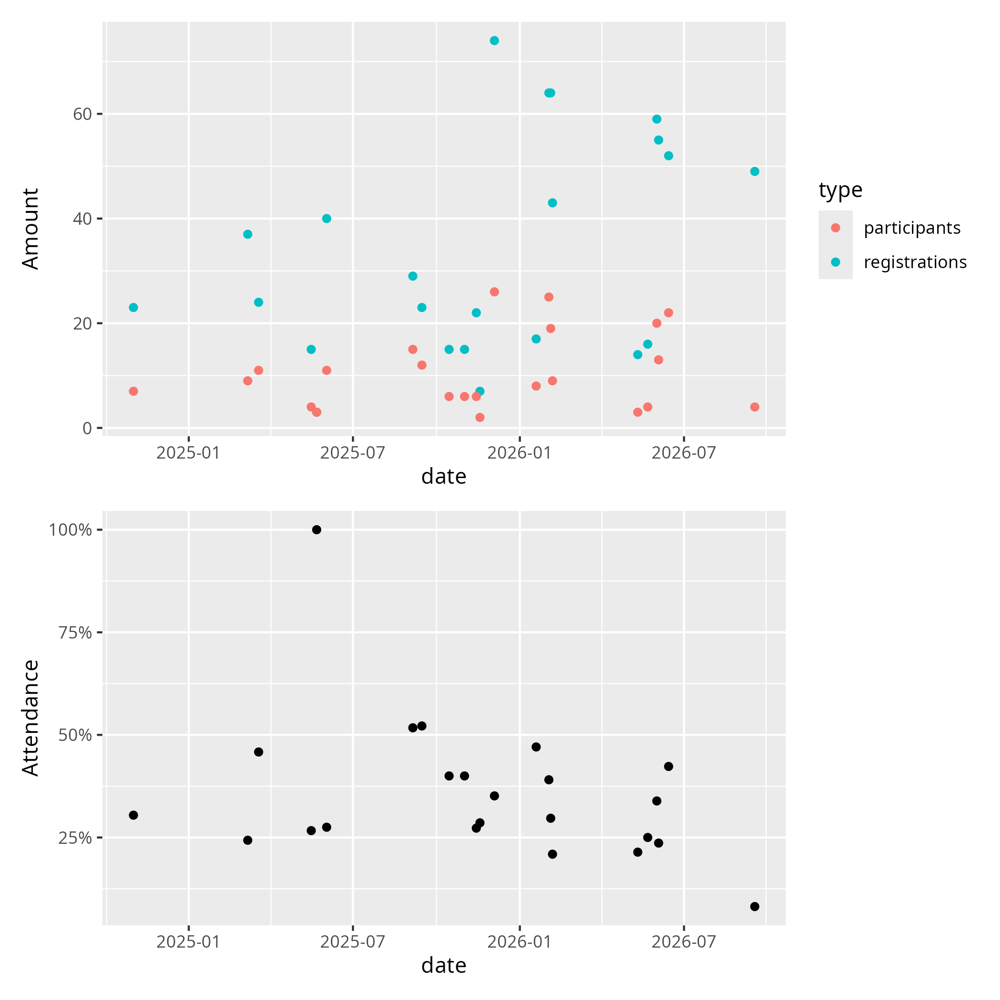

# Appendix 1: course attendance

The idea presented behind the course fee is that
it will help registered participants to actually show up.

Course attendance is a known problem.
Ideally, we want it to be 100%, i.e. that all learners
that register for a course show up. In practice,
for  this is what it may look like in practice:

> Figure 1: course attendance. See [the procedure below](#procedure)
> to see how this figure is generated.

By eyeballing (and ignoring the 100% outlier, where 3 out of 3 showed up)
we see that in those course we expect around 1 in 3 registered learners to
actually show up. Although this figure shows the problem of a
less-than-100-percent-attendance rate, it also shows a solution
to this problem that is used at NAISS and UPPMAX: they **estimate**
how many will show up.

## Procedure

I went through
[all the courses I teach](https://richelbilderbeek.github.io/teaching/teaching_overview/)
and checked for all courses that collect data on both the number
of registrations and attendance.
Then I copy-pasted the data that was easy to obtain
to this document, including a link to where I copy-pasted the
data from.

From this,
I created the data file [`attendance_rates.csv`](attendance_rates.csv)
(also, from a copy-paste, then some quick ruthless editing).
The plot was created by the script
[`create_attendence_plot.R`](create_attendence_plot.R).

### [Bianca workshops](https://uppmax.github.io/bianca_workshops/data/#amounts)

Course      |Iteration |Course date|Registered|Showing up|Evaluated
------------|----------|-----------|----------|----------|---------
Beginner    |4         |2025-03-19 |24        |11 (46%)  |11 (100%)
Intermediate|4         |2025-05-22 |3         |3 (100%)  |2 (66%)
Beginner    |5         |2025-09-15 |23        |12 (52%)  |8 (67%)
Intermediate|5         |2025-11-18 |7         |2 (29%)   |2 (100%)
Beginner    |6         |2026-02-06 |43        |9 (21%)   |8 (89%)
Intermediate|6         |2026-05-22 |16        |4 (25%)   |2 (50%)
Beginner    |7         |2026-98-17 |49        |4 (8%)    |~3 (~89%)

### [Intro to UPPMAX](https://uppmax.github.io/uppmax_intro_day_1/data/#amounts-of-learners)

No       |Date        |Registered|Showing up|Evaluated |Notes
---------|------------|----------|----------|----------|-----
3        | 2025-10-15 |15        |6 (40%)   |6 (100%)  |Online
4        | 2026-01-19 |17        |8 (47%)   |5 (63%)   |Online

### [NAISS Transfer 102](https://hpc.pages.naiss.se/training/transfer-102/data/#numbers)

No |Date      |Registered|Present and active |Evaluated
---|----------|----------|-------------------|-------------
1  |2026-05-11|14        |3 (21%)            |3 (100%)

### [Linux Command Line 102](https://uppmax.github.io/linux-command-line-102/data/#amounts__of__learners)

No |Dates                    |`n_reg`|`n_learn` | `n_eval`
---|-------------------------|-------|----------|-----------
1  |2025-06-02 and 2025-06-03|40     |11 (28%)  | 11 (100%)
2  |2025-12-04 and 2025-12-05|74     |26 (35%)  | 15 (71%)
3  |2026-02-04               |64     |19 (30%)  | 13 (68%)
4  |2026-06-03               |55     |13 (24%)  | 7 (54%)

### [Programming Formalisms](https://uppmax.github.io/programming_formalisms/data/#registrations)

Date       |Number of registrations |Present and active
-----------|------------------------|------------------
Autumn 2024|23                      |~7 (30%)
Autumn 2025|15                      |~6 (40%)

### [Connect and File Transfer](https://hpc.pages.naiss.se/training/connect-transfer/data/#numbers)

No |Date      |Registered|Showing up|Evaluated
---|----------|----------|----------|-------------
1  |2025-03-07|37        |9 (24%)   |8 (89%)
2  |2025-05-16|15        |4 (27%)   |3 (75%)
3  |2025-09-05|29        |15 (52%)  |10 (67%)
4  |2025-11-14|22        |6 (27%)   |5 (83%)
5  |2026-02-02|64        |25 (41%)  |15 (60%)
6  |2026-06-01|59        |20 (34%)  |14 (70%)
7  |2026-06-14|52        |22 (42%)  |13 (59%)
