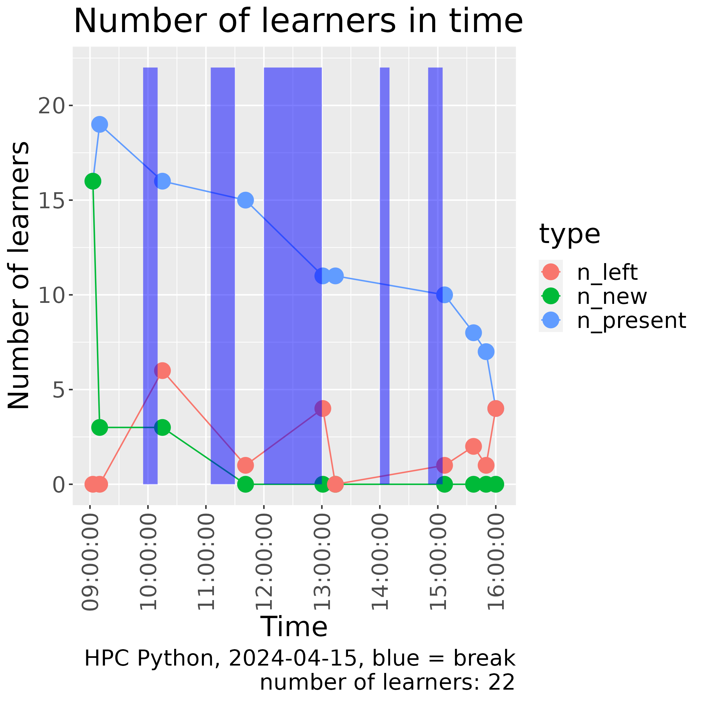
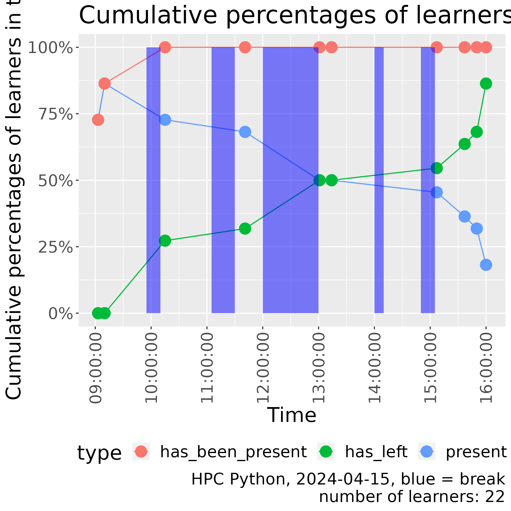

# Reflection

This is one of [my reflections](../README.md).

- Teaching assistant: Richel
- Date: 2024-04-15
- Course: Python for HPC

I was a teaching assistant in this course.

- [Data](n_learners_in_time.csv)
- [Script](create_n_learners_in_time_plot.R)

