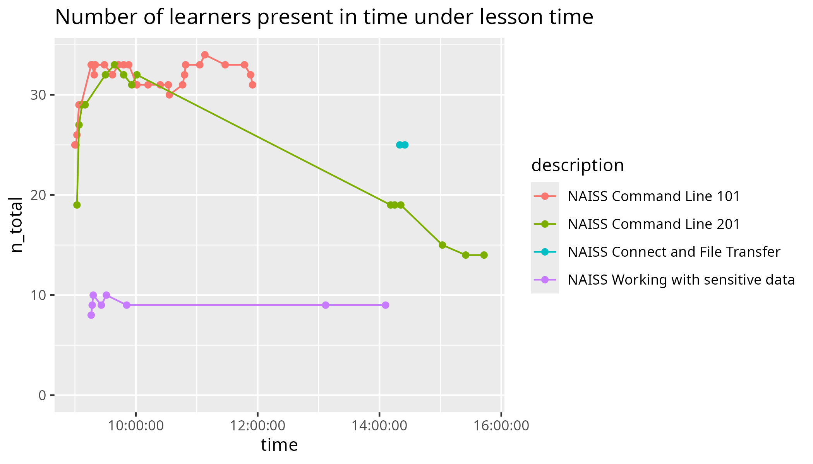

# NAISS Intro Week February 2026 

## My teaching

**When**    | **Duration** | **What**                                                                                                                 | **Lesson plan**                                                                                                     | **Evaluation**                                                                                                                                                                                                                    | **Reflection**
------------|--------------|--------------------------------------------------------------------------------------------------------------------------|---------------------------------------------------------------------------------------------------------------------|-----------------------------------------------------------------------------------------------------------------------------------------------------------------------------------------------------------------------------------|------------------------------------------------------------------------------------------------------------------
2025-02-06  | Full day     | [Bianca workshop](https://uppmax.github.io/bianca_workshops/), Basic                                                     | [Lesson plan](https://uppmax.github.io/bianca_workshops/lesson_plans/20260206/20260206_richel/)                     | [Evaluation](https://uppmax.github.io/bianca_workshops/evaluations/20260206)                                                                                                                                                      | [Reflection](https://uppmax.github.io/bianca_workshops/reflections/20260206/20260206_richel/)
2026-02-04  | Full day     | [Command Line 201](https://uppmax.github.io/linux-command-line-201/)                                                     | [Lesson plan](https://uppmax.github.io/linux-command-line-201/lesson_plans/20260204/)                               | [Evaluation](https://uppmax.github.io/linux-command-line-201/evaluations/20260204/)                                                                                                                                               | [Reflection](https://uppmax.github.io/linux-command-line-201/reflections/20260204/)
2026-02-02  | Half day     | [NAISS Connect and File Transfer course](https://uppmax.github.io/naiss_file_transfer_course/)                           | [Lesson plan](https://uppmax.github.io/naiss_file_transfer_course/lesson_plans/20260202/)                           | [Evaluation](https://uppmax.github.io/naiss_file_transfer_course/evaluations/20260202/)                                                                                                                                           | [Reflection](https://uppmax.github.io/naiss_file_transfer_course/reflections/20260202/)
