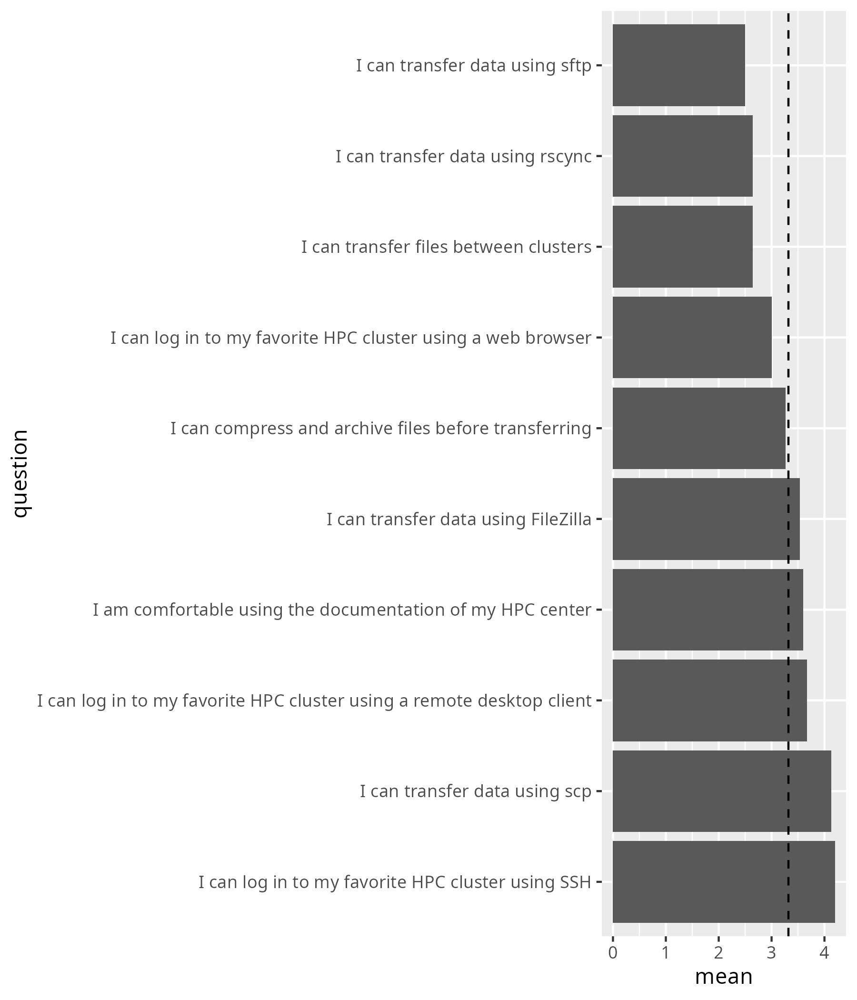
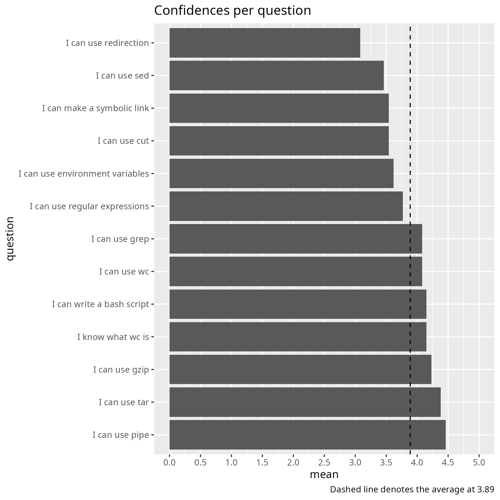
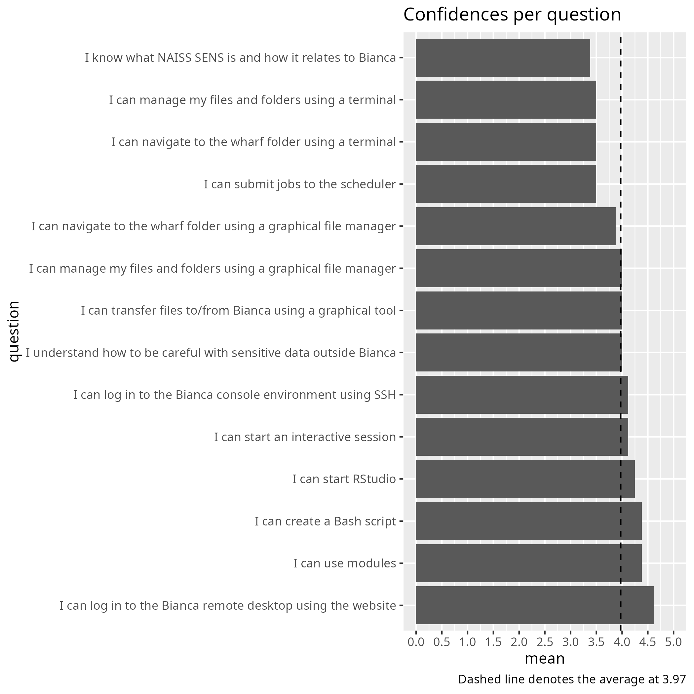

# NAISS Intro Week February 2026

This is one of [my reflections](../README.md).

## [Part of my 'Connect and File Transfer' reflection](https://uppmax.github.io/naiss_file_transfer_course/reflections/20260202/)

I think the NAISS Intro Week should be a gentle and easy first week to work
with our HPC clusters. I would say it is more important to adapt to
our learners than fit in as much content as possible.

Due to this I recommend:

- 1 hour for introduction to HPC, including SUPR
- 2 hours for the 'Connect' part
- 3 hours for the 'File transfer' part

Having this course the full first day would help even the utmost beginner
to have an easy first day on our HPC clusters. I think we should prefer
this over rushing our new users.

## Number of learners present

Data and scripts can be found at
[my teaching data](https://richelbilderbeek.github.io/teaching/data/counts/).

## Learning outcomes achieved

<!-- markdownlint-disable MD013 --><!-- Tables cannot be split up over lines, hence will break 80 characters per line -->

Course                     |Learning outcomes achieved                         |Source
---------------------------|---------------------------------------------------|--------------------------------------------------------------------------------------------------------------------
Connect and File Transfer  ||[URL](https://uppmax.github.io/naiss_file_transfer_course/evaluations/20260202/average_confidences_per_question.png)
Command Line 201           |                 |[URL](https://uppmax.github.io/linux-command-line-201/evaluations/20260204/average_confidences_per_question.png)
Working with sensitive data|  |[URL](https://uppmax.github.io/bianca_workshops/evaluations/20260206/average_confidences_per_question.png)

<!-- markdownlint-enable MD013 -->

## Overview of my teaching

<!-- markdownlint-disable MD013 --><!-- Tables cannot be split up over lines, hence will break 80 characters per line -->

**When**    | **Duration** | **What**                                                                                                                 | **Lesson plan**                                                                                                     | **Evaluation**                                                                                                                                                                                                                    | **Reflection**
------------|--------------|--------------------------------------------------------------------------------------------------------------------------|---------------------------------------------------------------------------------------------------------------------|-----------------------------------------------------------------------------------------------------------------------------------------------------------------------------------------------------------------------------------|------------------------------------------------------------------------------------------------------------------
2025-02-06  | Full day     | [Bianca workshop](https://uppmax.github.io/bianca_workshops/), Basic                                                     | [Lesson plan](https://uppmax.github.io/bianca_workshops/lesson_plans/20260206/20260206_richel/)                     | [Evaluation](https://uppmax.github.io/bianca_workshops/evaluations/20260206)                                                                                                                                                      | [Reflection](https://uppmax.github.io/bianca_workshops/reflections/20260206/20260206_richel/)
2026-02-04  | Full day     | [Command Line 201](https://uppmax.github.io/linux-command-line-201/)                                                     | [Lesson plan](https://uppmax.github.io/linux-command-line-201/lesson_plans/20260204/)                               | [Evaluation](https://uppmax.github.io/linux-command-line-201/evaluations/20260204/)                                                                                                                                               | [Reflection](https://uppmax.github.io/linux-command-line-201/reflections/20260204/)
2026-02-02  | Half day     | [NAISS Connect and File Transfer course](https://uppmax.github.io/naiss_file_transfer_course/)                           | [Lesson plan](https://uppmax.github.io/naiss_file_transfer_course/lesson_plans/20260202/)                           | [Evaluation](https://uppmax.github.io/naiss_file_transfer_course/evaluations/20260202/)                                                                                                                                           | [Reflection](https://uppmax.github.io/naiss_file_transfer_course/reflections/20260202/)

<!-- markdownlint-enable MD013 -->
