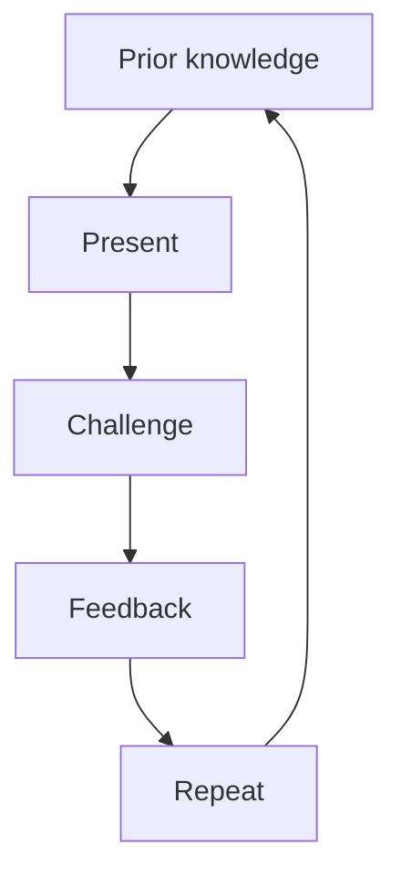

# Richèl

## How to pronounce my name

| Language  | Pronunciation |
| --------- | ------------- |
| **Dutch** | 'Rie-sjel'    |
| English   | 'Rea-shell'   |
| French    | 'Richèl'      |
| German    | 'Ri-shäll'    |
| Swedish   | 'Ri-kjell'    |

## Teaching

- 2007-2008 MSc: Teaching in Pre-higher education in Biology
- Oct 2008-Aug 2010: 0.6 FTE teacher and team leader, 12-18 yo
- Jan 2014-Jan 2021: coordinator of multiple courses, as volunteer, 8-18 yo
- Sep 2019-Mar 2024: team leader of programming team, 13-38 yo
- Sep 2022-now: coordinator of multiple courses, as volunteer, 8-88 yo
- Mar 2023-now: teacher at UPPMAX, 18-88 yo

## Teaching style

- Literate `[1]`
- Evidence-based,
  e.g. `[Bell, 2020][Hattie, 2012][Hattie, 2023][Schwartz, 2012]`
- Active learning
- Learning community
- Well-prepared `[1]`
- Student-centered
- Transparent `[1]`

## Features

- Every learner needs to be active
- Follows the pace of learners that need more time
- Fast learners learn by helping
- Asks learners randomly, as he should `[Bell, 2020][Eddy et al, 2015]`
    - Some really like it `[3]`
    - Some really don't `[4]`
- Dare to try out new things (and fail in plain sight) `[Bell, 2020]`

## Lecturing

I only do this for unimportant topics,
as lecturing hinders learning `[2]`.

Hence, this was the only lecture in the course :-)

(I **do** need to tell about myself `[Schwartz, 2012]`)

## My favorite teaching cycle

> Evidence-based teaching cycle, from `[Bell, 2020]`

## References

- `[1]` <https://github.com/richelbilderbeek/teaching>
- `[2]` See `[Hattie, 2023]`, page 363, effect size is -0.26 with a robustness
  index of 4 out of 5
  and is based on 3 meta analyses using 273 studies using 27,296 people,
  measuring for 614 effects with a standard error of 0.08.
  One example open access study is `[Knight & Wood, 2005]`.
- `[3]` [Programming Formalisms 2024 autumn evaluation](https://uppmax.github.io/programming_formalisms/evaluations/2024_autumn/teacher_comments.csv)
- `[4]` [R-Python-Julia-MATLAB course, Python day](https://github.com/UPPMAX/R-python-julia-matlab-HPC/blob/main/evaluations/20241022/20241022_python.csv)
- `[Anderson & Krathwohl, 2001]` Anderson, Lorin W., and David R. Krathwohl.
  A taxonomy for learning, teaching, and assessing:
  A revision of Bloom's taxonomy of educational objectives: complete edition.
  Addison Wesley Longman, Inc., 2001.
- `[Bell, 2020]` Bell, Mike. The fundamentals of teaching:
  A five-step model to put the research evidence into practice. Routledge, 2020.
- `[Eddy et al, 2015]`
  Eddy, Sarah L., Mercedes Converse, and Mary Pat Wenderoth.
  "PORTAAL: A classroom observation tool assessing evidence-based teaching
  practices for active learning in large science, technology, engineering,
  and mathematics classes." CBE—Life Sciences Education 14.2 (2015): ar23.
- `[Knight & Wood, 2005]` Knight, Jennifer K., and William B. Wood.
  "Teaching more by lecturing less." Cell biology education 4.4 (2005): 298-310.
  [paper](https://www.lifescied.org/doi/full/10.1187/05-06-0082)
- `[Hattie, 2012]` Hattie, John. Visible learning for teachers:
  Maximizing impact on learning. Routledge, 2012.
- `[Hattie, 2023]` Hattie, John. Visible learning:
  The sequel: A synthesis of over 2,100 meta-analyses relating to achievement.
  Routledge, 2023.
- `[Hattie & Clarke, 2018]` Hattie, John, and Shirley Clarke. Visible learning:
  feedback. Routledge, 2018.
- `[Schwartz, 2012]` Schwartz, Beth M., and Regan AR Gurung.
  Evidence-based teaching for higher education.
  American Psychological Association, 2012.

## My favorite literature

- `[Bell, 2020]` Bell, Mike. The fundamentals of teaching:
  A five-step model to put the research evidence into practice. Routledge, 2020.
- `[Hattie, 2012]` Hattie, John. Visible learning for teachers:
  Maximizing impact on learning. Routledge, 2012.
- `[Hattie, 2023]` Hattie, John. Visible learning:
  The sequel: A synthesis of over 2,100 meta-analyses relating to achievement.
  Routledge, 2023.
