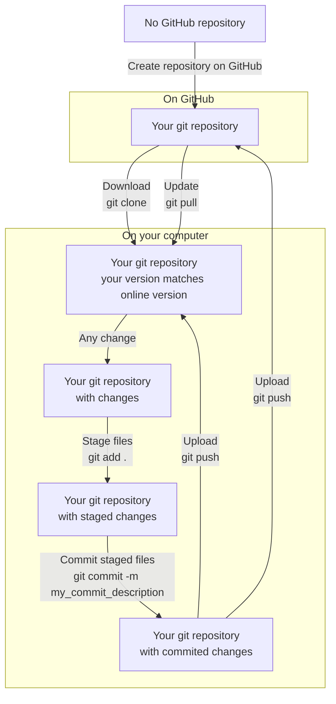
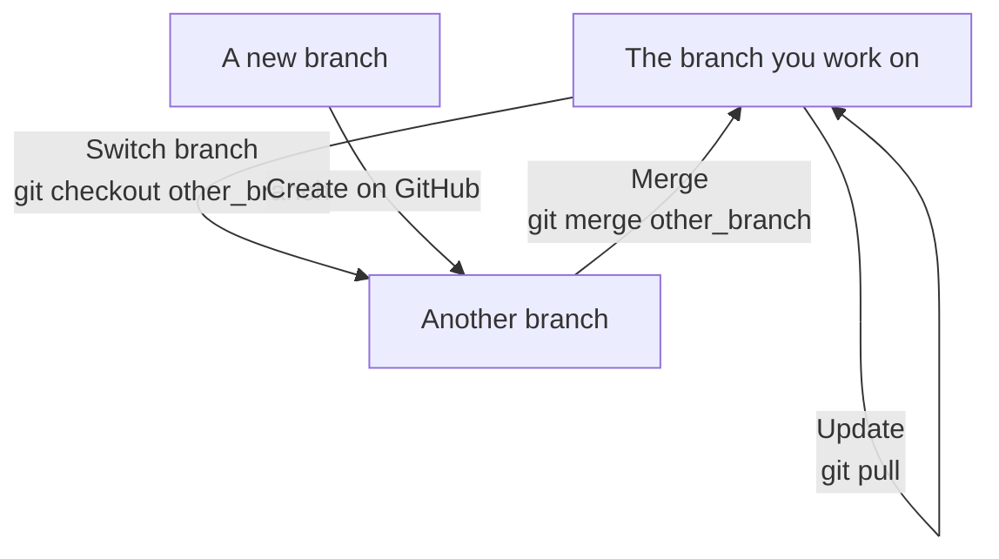

# git

## git basic workflow

```mermaid
flowchart TD
  no_repo[No GitHub repository]
  subgraph on_github[On GitHub]
    github[Your git repository]
  end
  subgraph on_computer[On your computer]
    clean[Your git repository\nyour version matches online version]
    changed[Your git repository\nwith changes]
    staged[Your git repository\nwith staged changes]
    committed[Your git repository\nwith commited changes]
  end

  no_repo --> |Create repository on GitHub|github
  github --> |Download\ngit clone| clean
  github --> |Update\ngit pull| clean


  clean --> |Any change|changed
  changed --> |Stage files\ngit add .|staged
  staged --> |Commit staged files\ngit commit -m my_commit_description| committed
  committed ---> |Upload\ngit push| clean
  committed --> |Upload\ngit push| github
```

## git workflow with branches

```mermaid
flowchart TD
  your_branch[The branch you work on]
  another_branch[Another branch]
  new_branch[A new branch]

  your_branch --> |Switch branch\ngit checkout other_branch|another_branch
  another_branch --> |Merge\ngit merge other_branch| your_branch
  new_branch --> |Create on GitHub|another_branch
  your_branch --> |Update\ngit pull| your_branch
```
