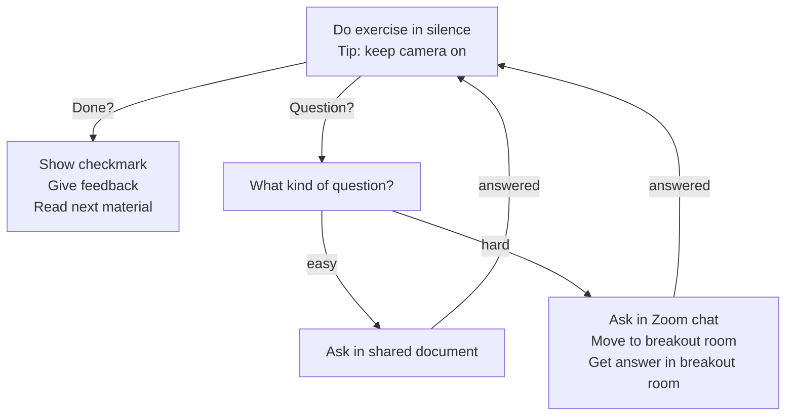

# Work in silent

```mermaid
flowchart TD
  start[Do exercise in silence\nTip: keep camera on]
  done[Show checkmark\nGive feedback\nRead next material]
  question[What kind of question?]
  easy_question[Ask in shared document]
  hard_question[Ask in Zoom chat\nMove to breakout room\nGet answer in breakout room]

  start --> |Done?| done
  start --> |Question?| question
  question --> |easy| easy_question
  question --> |hard| hard_question
  easy_question --> |answered| start
  hard_question --> |answered| start
```
