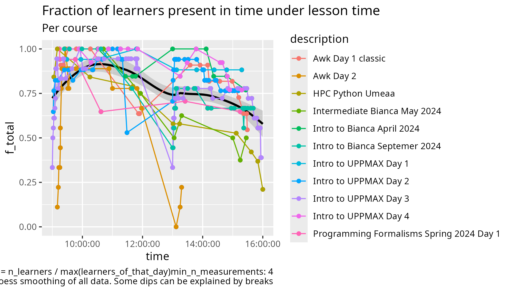
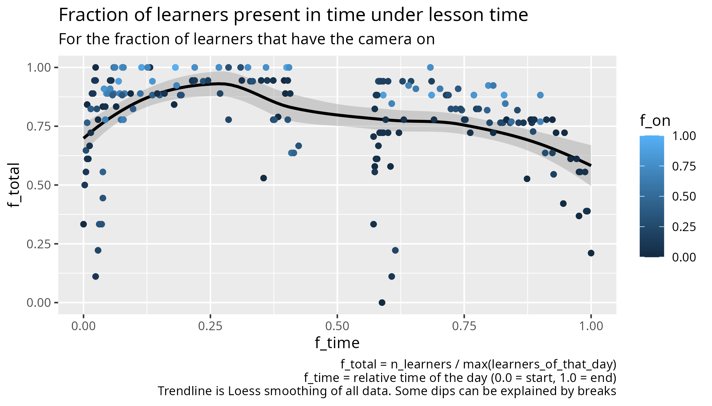
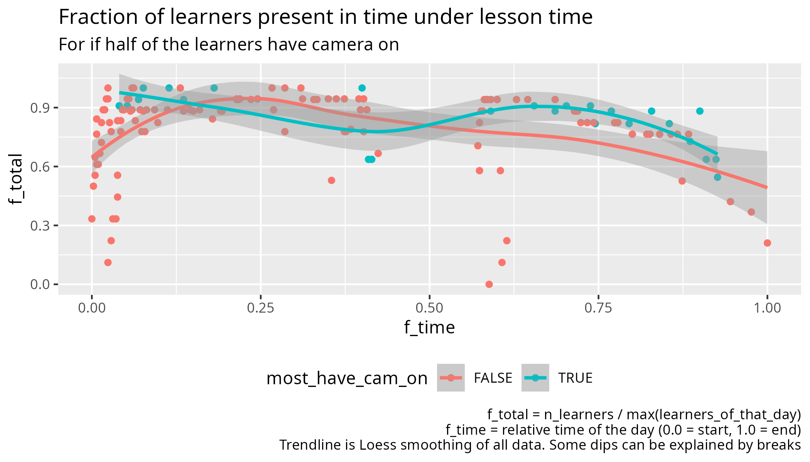
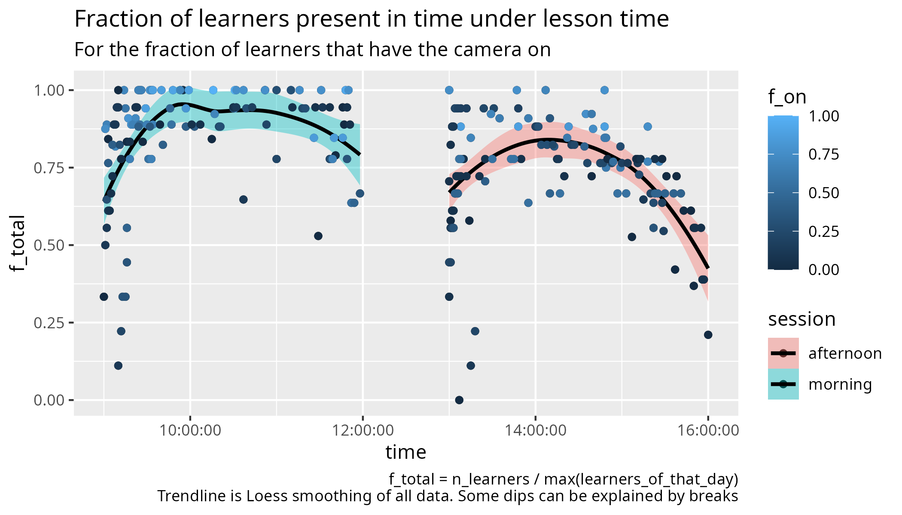
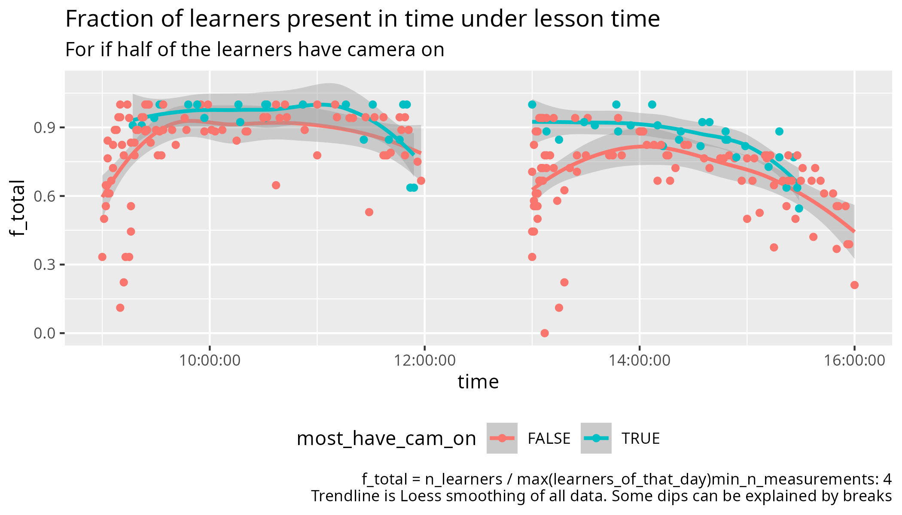

# Counts

Goal of this experiment is to see how important camera usage is for
keeping learners in an online course.

## Preliminary conclusions

- At 10:00 and 14:00 the amount of learners peaks
- When most learners have had their camera on before lunch,
  more return after lunch

## Do trendline per day

## Do trendline per session

