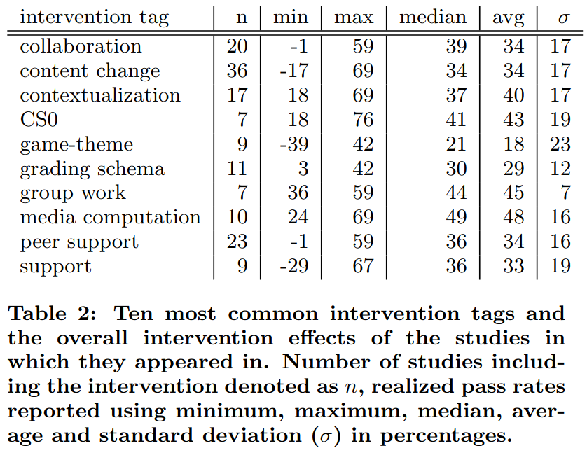

# Teaching online

Media computation, group work and CS0 have the highest average pass rate:

> Table 2 from `[Vihavainen et al., 2014]`: 
> 'Ten most common intervention tags and
> the overall intervention effects of the studies in
> which they appeared in. 
> Number of studies including the intervention denoted as n,
> realized pass rates reported using minimum, maximum, median, 
> average and standard deviation (σ) in percentages'.

Here are the definitions given in that paper:

- 'CS0 : the creation of a preliminary course that was to
  be taken before the introductory programming course;
  could be organized only for e.g. at-risk students
- 'group work : activities with increased group work
  commitment such as team-based learning and cooperative
  learning'
- 'media computation: activities explicitly declaring the
  use of media computation (e.g. the book)'. The paper elaborates with: 
  'each article that was coded with the tag media computation, tags content:
  media, contextualization, context: media, were added to de-
  scribe that the content (material) of the course was updated
  to contain media-type content, the course was contextual-
  ized so that the content had more meaning to the students
  that participated in the course, and finally, that the context
  revolved around media'

The study `[Medeiros et al., 2018]` tries to do a review on teaching
programming, with a big heterogeneity in how experiments are performed.
A main finding is:

> The most frequently cited skills necessary for
> learning programming were related to problem solving and mathematical ability. 
> Problem solving was also cited as a learning
> challenge, followed by motivation and engagement, 
> and difficulties in learning the syntax of programming languages

Note the motivation and -especially- engagement:
this will be lacking in a monologue.

## References

- `[Vihavainen et al., 2014]` Vihavainen, Arto, Jonne Airaksinen, and Christopher Watson. "A systematic review of approaches for teaching introductory programming and their influence on success." Proceedings of the tenth annual conference on International computing education research. 2014.
- `[Medeiros et al., 2018]` Medeiros, Rodrigo Pessoa, Geber Lisboa Ramalho, and Taciana Pontual Falcão. "A systematic literature review on teaching and learning introductory programming in higher education." IEEE Transactions on Education 62.2 (2018): 77-90.